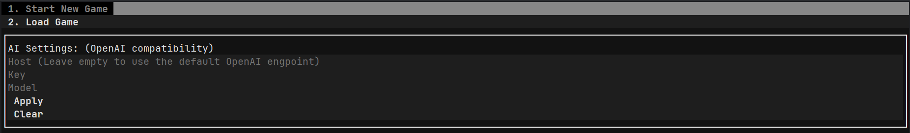

# Terminara

A terminal-based ai simulation game.

## How to use

Supported platforms: Windows, Linux

You can download the executable application from [latest release](https://github.com/luyiourwong/Terminara/releases/latest).

The full compressed file includes the executable file and the default world settings file. You can only download the executable file if you are updating the game to the latest version.

<details>
<summary><strong>Manual build</strong></summary>

### Installation

1.  **Clone the repository:**
    ```bash
    git clone https://github.com/luyiourwong/Terminara
    cd Terminara
    ```

2.  **Create a virtual environment:**
    ```bash
    python -m venv .venv
    source .venv/bin/activate
    ```
    On Windows, use `.venv\Scripts\activate`

3.  **Install the dependencies:**
    ```bash
    pip install -e .
    ```

#### Method 1: Using the installed command (Recommended)
After installation, run the game with:
```bash
terminara
```

#### Method 2: Direct execution
Cross-platform way
```bash
python -m terminara.main
```
or
```bash
python terminara/main.py
```
On Windows, use `terminara\main.py`

#### Method 3: Background execution for testing
This is a long-live program, so if you want to test it, you can use this command instead:

Unix/Linux/macOS
```bash
python -m terminara.main > app.log 2>&1 &
```
or Windows (background with start)
```bash
python terminara\main.py > app.log 2>&1
```

### Pack to Executable

1. **Prerequisites**
    ```bash
    pip install pyinstaller
    ```

2. **Run the Packaging Command**
    ```bash
    pyinstaller terminara.spec
    ```
After packaging is complete, the executable will be located in the `dist` directory

### Unit testing
```bash
python -m unittest discover -v
```
</details>

## AI Setup

After starting the application, you need to configure the AI settings from the main menu.



You need to fill in the following fields: (OpenAI compatibility API)
- **Host**: The API endpoint. Leave it empty to use the default OpenAI endpoint.
- **API Key**: Your API key for the AI service.
- **Model**: The model you want to use.

Click "Apply" to save the settings.

### Examples

#### 1. [OpenAI](https://platform.openai.com/) (Default)
- **Host**: (leave empty)
- **API Key**: `YOUR_OPENAI_API_KEY`
- **Model**: `gpt-4o-mini-2024-07-18`

#### 2. [Google AI Studio](http://aistudio.google.com/)
- **Host**: `https://generativelanguage.googleapis.com/v1beta/openai/`
- **API Key**: `YOUR_GEMINI_API_KEY`
- **Model**: `gemini-2.0-flash`
