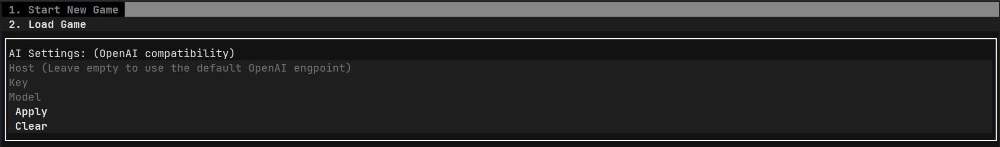

<div align="right">
  <details>
    <summary >🌐 Language</summary>
    <div>
      <div align="center">
        <a href="https://openaitx.github.io/view.html?user=luyiourwong&project=Terminara&lang=en">English</a>
        | <a href="https://openaitx.github.io/view.html?user=luyiourwong&project=Terminara&lang=zh-CN">简体中文</a>
        | <a href="https://openaitx.github.io/view.html?user=luyiourwong&project=Terminara&lang=zh-TW">繁體中文</a>
        | <a href="https://openaitx.github.io/view.html?user=luyiourwong&project=Terminara&lang=ja">日本語</a>
        | <a href="https://openaitx.github.io/view.html?user=luyiourwong&project=Terminara&lang=ko">한국어</a>
        | <a href="https://openaitx.github.io/view.html?user=luyiourwong&project=Terminara&lang=hi">हिन्दी</a>
        | <a href="https://openaitx.github.io/view.html?user=luyiourwong&project=Terminara&lang=th">ไทย</a>
        | <a href="https://openaitx.github.io/view.html?user=luyiourwong&project=Terminara&lang=fr">Français</a>
        | <a href="https://openaitx.github.io/view.html?user=luyiourwong&project=Terminara&lang=de">Deutsch</a>
        | <a href="https://openaitx.github.io/view.html?user=luyiourwong&project=Terminara&lang=es">Español</a>
        | <a href="https://openaitx.github.io/view.html?user=luyiourwong&project=Terminara&lang=it">Italiano</a>
        | <a href="https://openaitx.github.io/view.html?user=luyiourwong&project=Terminara&lang=ru">Русский</a>
        | <a href="https://openaitx.github.io/view.html?user=luyiourwong&project=Terminara&lang=pt">Português</a>
        | <a href="https://openaitx.github.io/view.html?user=luyiourwong&project=Terminara&lang=nl">Nederlands</a>
        | <a href="https://openaitx.github.io/view.html?user=luyiourwong&project=Terminara&lang=pl">Polski</a>
        | <a href="https://openaitx.github.io/view.html?user=luyiourwong&project=Terminara&lang=ar">العربية</a>
        | <a href="https://openaitx.github.io/view.html?user=luyiourwong&project=Terminara&lang=fa">فارسی</a>
        | <a href="https://openaitx.github.io/view.html?user=luyiourwong&project=Terminara&lang=tr">Türkçe</a>
        | <a href="https://openaitx.github.io/view.html?user=luyiourwong&project=Terminara&lang=vi">Tiếng Việt</a>
        | <a href="https://openaitx.github.io/view.html?user=luyiourwong&project=Terminara&lang=id">Bahasa Indonesia</a>
        | <a href="https://openaitx.github.io/view.html?user=luyiourwong&project=Terminara&lang=as">অসমীয়া</a>
      </div>
    </div>
  </details>

</div>

# Terminara

[](https://deepwiki.com/luyiourwong/Terminara)


A terminal-based ai simulation game.

## How to use

You can download the executable application from [latest release](https://github.com/luyiourwong/Terminara/releases/latest).

The full compressed file includes the executable file and the default world settings file. You can only download the executable file if you are updating the game to the latest version.

| OS      | Version                                                            |
|---------|--------------------------------------------------------------------|
| Windows | Windows 10, Windows 11                                             |
| Linux   | (GLIBC 2.35+) Ubuntu 22.04 LTS, Ubuntu 24.04 LTS, Ubuntu 26.04 LTS |
| MacOS   | macOS 13, macOS 14, macOS 15, macOS 26                             |

<details>
<summary><strong>Manual run</strong></summary>

### Installation

1.  **Clone the repository:**
    ```bash
    git clone https://github.com/luyiourwong/Terminara
    cd Terminara
    ```

2.  **Install environment:**
    We recommend using [uv>=0.4.27](https://github.com/astral-sh/uv) to synchronize locked dependencies.
    ```bash
    uv sync
    source .venv/bin/activate
    ```
    On Windows, use `.venv\Scripts\activate`

### Start
After installation, run the game with:
```bash
terminara
```
for more information, see [Contribute & Develop Guide](CONTRIBUTING.md).
</details>

## AI Setup

After starting the application, you need to configure the AI settings from the main menu.



You need to fill in the following fields: (OpenAI compatibility API)
- **Host**: The API endpoint. Leave it empty to use the default OpenAI endpoint.
- **API Key**: Your API key for the AI service.
- **Model**: The model you want to use.

Click "Apply" to save the settings.

### Examples

#### 1. [OpenAI](https://platform.openai.com/) (Default)
- **Host**: (leave empty)
- **API Key**: `YOUR_OPENAI_API_KEY`
- **Model**: `gpt-4o-mini-2024-07-18`

#### 2. [Google AI Studio](http://aistudio.google.com/)
- **Host**: `https://generativelanguage.googleapis.com/v1beta/openai/`
- **API Key**: `YOUR_GEMINI_API_KEY`
- **Model**: `gemini-2.0-flash`

## World Setup

### Configuration Storage
World settings are stored in the `terminara/data/worlds` directory. (in full release)
```
.
|-- terminara/
|   `-- data/
|       |-- schema/           # Json schema files for world settings
|       `-- worlds/           # Directory for world setting files
`-- terminara_platform_version        # Executable file
```

### Creating a new world
There is a example world [aethelgard.json](terminara/data/worlds/aethelgard.json). You can follow the [schema](terminara/data/schema/world_schema.json) to create a new world.

## Links

- [GitHub Pages](https://luyiourwong.github.io/Terminara)
- [GitHub Repository](https://github.com/luyiourwong/Terminara)
- [Contribute & Develop Guide](CONTRIBUTING.md)

## License

This project is licensed under the [MIT License](LICENSE).
